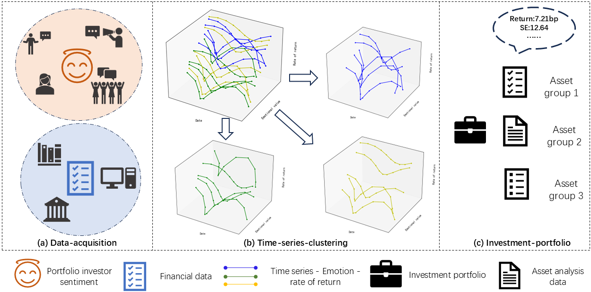
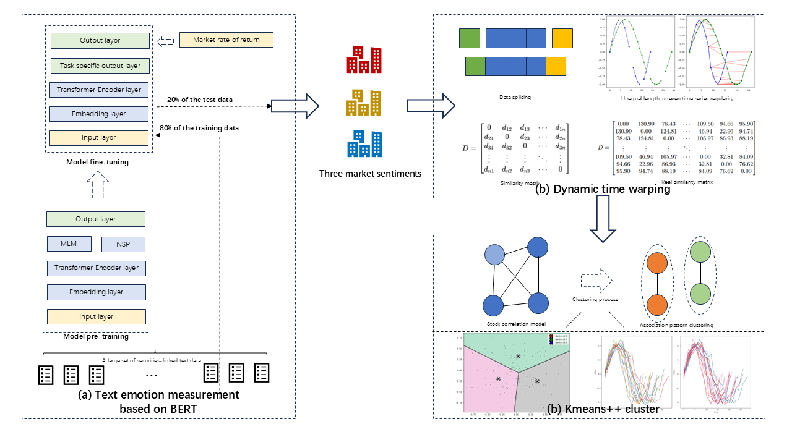

# Sentiwave-Investment-portfolio
本项目提供一种投资组合新范式，即通过嵌入式的FinBERT模型融合DTW聚类算法，该方法在统计检验和投资组合上皆展现出优越效果，并且本项目提供与7种不同的情绪分析模型进行横向对比，与4种不同的聚类方法进行纵项对比，并有三种不同的数据鲁棒性检验，皆具有良好效果。

## 项目简介

- 引入多源数据（股吧、微博等），提升了情绪刻画的鲁棒性；
- 在聚类基础上，结合解释性回归分析，揭示了情绪在流动性（换手率、成交量）与波动性等维度上的独立预测力；
- 增加横向对比实验：与 7 种情绪分析模型（词典法、机器学习法、深度学习法）比较，验证了 FinBERT 嵌入方案的显著优势；
- 增加纵向对比实验：与 4 种聚类方法比较，证明了基于 DTW 的形状聚类在非线性金融时间序列建模中的优越性。
  
## 技术原理
本项目的技术核心为 **SentiWave 框架**，该框架通过两阶段方法实现对金融市场中情绪与收益动态关系的建模：
1. **情绪信号提取**：基于金融领域专用的 FinBERT 模型，利用大规模股吧/财经评论数据进行预训练与微调，将非结构化文本映射为高维情绪向量。相比一般论文方法仅提取一维的“中间指标”得分作为输入，Ours提取 768 维的高维语义嵌入，更好捕捉复杂的金融语境和隐含情绪特征。
2. **基于形状的时序聚类**：将每日情绪向量与个股收益率组合为双变量时间序列，利用 DTW（动态时间规整）计算序列相似度，并采用 K-means 聚类识别不同的“情绪-收益”模式簇。此方法能够处理时间错位与非线性动态特征，从而揭示个股对投资者情绪的异质性反应。  

## 实证结果对比

### 单因子分析
- **经济因子 (Econ)**：在日收益预测上表现突出 (R²=22.451%)，但在振幅、成交量、换手率上的解释力几乎为零，仅能捕捉系统性风险，不适合刻画投资者行为异质性。
- **情绪因子 (Ours)**：在收益预测上 (R²=8.834%) 略逊于经济因子，但在振幅 (12.859%)、成交量 (15.858%)、换手率 (14.547%) 上明显优于所有对比模型，说明情绪因子更适合刻画微观行为与流动性冲击。
- **对比模型**：传统词典法、机器学习方法（SVM、RF、LR 等）、SBERT 在行为变量上解释力普遍低于 1%，远不及本项目提出的 SentiWave。

简化表 1：不同情绪模型横向对比 (R² %)
------------------------------------------------
指标            | SVM   | RF    | LR    | DLUT  | Bian  | Jiang | SBERT | Ours
----------------|-------|-------|-------|-------|-------|-------|-------|-------
日收益率        | 0.002 | 0.002 | 0.007 | 0.281 | 0.281 | 0.386 | 1.011 | 8.834
日振幅          | 0.433 | 0.068 | 0.141 | 0.020 | 0.020 | 0.005 | 0.040 | 12.859
市盈率          | 0.011 | 0.008 | 0.003 | 0.000 | 0.000 | 0.002 | 0.141 | 3.472
成交量          | 0.940 | 0.176 | 0.575 | 0.076 | 0.076 | 0.026 | 0.167 | 15.858
换手率          | 0.100 | 0.134 | 0.002 | 0.016 | 0.016 | 0.001 | 0.171 | 14.547

### 双因子分析
- 经济因子 + 情绪因子联合后，R² 在收益率上提升到 27.370%，比单独经济因子提升 21.9%，比单独情绪因子提升 210%，说明两者具有非线性协同效应。
- 在成交量、换手率等行为变量上，双因子模型也全面优于单因子。
- PE 指标整体解释力依旧有限 (R²≈3.472%)，说明估值更多由长期现金流驱动，短期因子影响较小。

简化表 2：单因子 vs 双因子回归对比 (R² %)
------------------------------------------------
指标            | Econ 单因子 | Ours 单因子 | Econ+Ours 双因子
----------------|-------------|-------------|------------------
日收益率        | 22.451      | 8.834       | 27.370
日振幅          | 0.354       | 12.859      | 13.093
市盈率          | 0.000       | 3.472       | 3.472
成交量          | 0.180       | 15.858      | 15.965
换手率          | 0.151       | 14.547      | 14.636

### 聚类增强模型
- 引入三类聚类（情绪放大、情绪钝化、情绪反转），R² 提升显著：收益率解释力由 8.834% 提升至 30.864%，成交量由 15.858% 提升至 23.368%，PE 由 3.472% 提升至 10.316%。
- 不同簇揭示了市场存在明显异质性：部分股票受情绪主导，部分表现出反转效应，部分则更接近基本面。

### 总结
- Econ 捕捉系统性风险，Ours 捕捉情绪溢价，两者结合能显著提升解释力。
- SentiWave 在横向对比 7 种情绪模型、纵向对比 4 种聚类方法中表现最优。
- 聚类增强后的情绪回归在大多数市场指标上实现数倍提升，验证了本方法在投资组合构建中的实用性。

## 投资组合对比  
在投资组合构建上，本项目将聚类结果作为选股因子，设计短期与长期投资组合：
- **短期组合**：利用情绪反转信号捕捉超额收益；
- **长期组合**：基于情绪放大簇构建稳健多因子策略；
- 回测结果表明，无论长期还是短期，本项目投资组合均显著优于市场基准，且在不同市场环境下保持较强的稳定性。

**查看短期投资组合累计收益请点击-->**[查看短期投资组合累计收益](Short-term_Investment.pdf)  
**查看长期投资组合累计收益请点击-->**[查看长期投资组合累计收益](Long-term_Investment.pdf)
